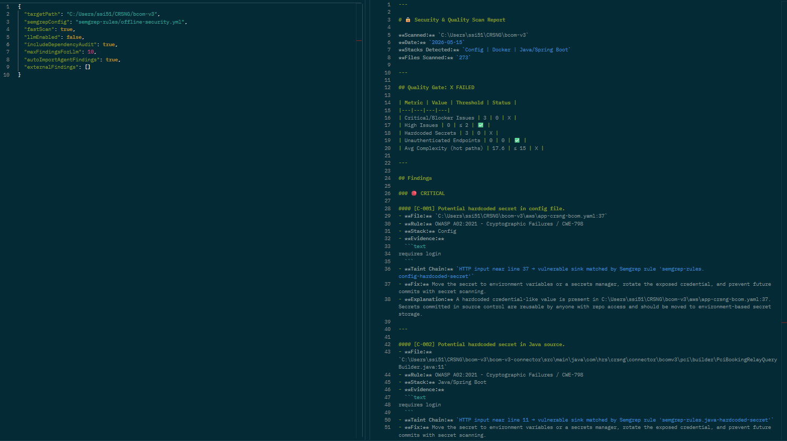
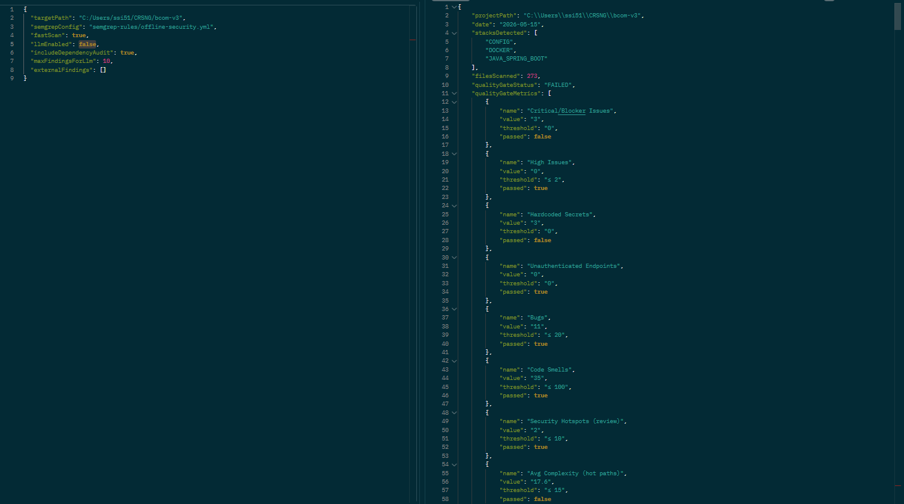

# AI Security Scanner 🔐

A Spring Boot security analysis platform that combines **Semgrep** static analysis, optional **LLM-based triage**, dependency checks, and complexity heuristics to generate **SonarQube-style reports** for local repos, CI pipelines, and API workflows.

It is designed for teams that want practical, offline-first security scanning with deterministic output by default, plus deeper exploitability reasoning when an LLM endpoint is enabled.

## Project description

AI Security Scanner analyzes source code and project metadata, normalizes findings across multiple inputs, and publishes a single report that can be used in dashboards, pull-request discussions, or release gates.

The scanner supports both API and CLI usage, can ingest external agent findings, and works with a local Semgrep ruleset when hosted rule sources are restricted.

## Feature highlights

- **Offline Semgrep rule pack** aligned to SonarQube + Trivy-style signal categories
  - injection and code execution risks (command injection, unsafe eval/exec, insecure deserialization)
  - exposed secrets and security misconfiguration smells in source and config files
  - weak crypto and entropy issues (MD5/SHA-1 usage, non-crypto random sources)
  - insecure HTTP/TLS usage patterns and trust-validation bypass hotspots
  - framework hotspots (for example Spring Security `permitAll()` and CSRF disable patterns)
  - code hygiene findings that often correlate with risk (debugger/console logging, stack trace exposure)
- **Optional LLM triage** for false-positive reduction, exploitability context, and tailored fixes
- **Dependency audit** support for common manifests (`pom.xml`, `package.json`, `requirements.txt`)
- **Complexity hotspot detection** for risky high-complexity methods/functions
- **Quality gate scoring** with JSON and Markdown outputs for CI/CD enforcement
- **Extensible ingestion** that merges findings from external security agents

## What this project does

- Runs `semgrep scan` against a target repository
- Extracts file, line, rule, severity, and evidence from findings
- Enriches findings with **10 lines of surrounding code context**
- Optionally sends findings to an **OpenAI-compatible LLM** (OpenAI, GitHub Models, Copilot-compatible proxy) for:
  - false-positive reduction
  - exploitability analysis
  - logic-aware explanations
  - remediation suggestions
- Audits dependencies in `pom.xml`, `package.json`, and `requirements.txt`
- Calculates heuristic complexity hotspots
- Produces:
  - structured JSON report
  - Markdown report in a **SonarQube-like format**
- Supports **REST API** and **CLI mode** for CI/CD pipelines
- Allows importing findings from an **external security agent** and merges them into the final report




## Architecture

- `SemgrepService` — executes Semgrep and parses JSON
- `ContextSnippetService` — captures surrounding code lines for each finding
- `LlmTriageService` — verifies exploitability and generates tailored remediation guidance
- `DependencyAuditService` — checks known vulnerable dependency versions
- `ComplexityAnalyzerService` — finds risky high-complexity methods/functions
- `ReportAssemblerService` — creates a quality gate and normalized report
- `MarkdownReportRenderer` — renders the exact report structure requested
- `ScanCliRunner` — optional CLI mode for CI usage

## Requirements

- Java 21
- Maven 3.8+
- Python + Semgrep installed and available in `PATH`
- Optional: a GitHub Models (or compatible) API key for LLM triage

## Configuration

Default settings live in `src/main/resources/application.properties`.

Key properties:

- `scanner.semgrep.command`: Semgrep executable, default `semgrep`
- `scanner.semgrep.default-config`: default rule config, default `semgrep-rules/offline-security.yml` (offline/local)
- `scanner.semgrep.jobs`: parallel workers for Semgrep, default `4`
- `scanner.semgrep.fast-rule-timeout-seconds`: per-rule timeout used in fast scan mode
- `scanner.semgrep.fast-excludes`: comma-separated directories excluded in fast scan mode
- `scanner.agent.enabled`: enable automatic external security agent ingestion
- `scanner.agent.command`: command to run external agent (supports `{targetPath}` placeholder)
- `scanner.agent.timeout-seconds`: timeout for external agent execution
- `scanner.llm.enabled`: enables/disables LLM enrichment
- `scanner.llm.base-url`: GitHub Models chat completions endpoint (or compatible)
- `scanner.llm.api-key`: API key
- `scanner.llm.model`: model name such as `gpt-4o-mini`
- `scanner.llm.provider-label`: label shown in reports/logs
- `scanner.cli.enabled`: enable CLI mode at startup
- `scanner.cli.target-path`: repository path to scan in CLI mode
- `scanner.cli.fail-on-quality-gate`: fail process when gate fails

## Run locally

### 1) Build and test

```powershell
mvn clean test
```

### 2) Start the API

```powershell
mvn spring-boot:run
```

### 3) Generate a report via REST

```powershell
$body = @'
{
  "targetPath": "C:/Users/ssi51/Documents/Project/AISecurityScanner",
  "semgrepConfig": "auto",
  "llmEnabled": false,
  "includeDependencyAudit": true,
  "maxFindingsForLlm": 10,
  "externalFindings": []
}
'@

Invoke-RestMethod -Method Post -Uri "http://localhost:8080/api/scans/report" -ContentType "application/json" -Body $body
```

### 4) Generate the SonarQube-style Markdown report

```powershell
Invoke-RestMethod -Method Post -Uri "http://localhost:8080/api/scans/report/markdown" -ContentType "application/json" -Body $body
```

### 5) Fast Semgrep scan mode (recommended for large repos)

Set `fastScan` to `true` in the request to apply Semgrep performance flags and default exclusions:

```powershell
$body = @'
{
  "targetPath": "C:/Users/ssi51/Documents/Project/AISecurityScanner",
  "semgrepConfig": "p/java",
  "fastScan": true,
  "llmEnabled": false,
  "includeDependencyAudit": true,
  "maxFindingsForLlm": 10,
  "externalFindings": []
}
'@

Invoke-RestMethod -Method Post -Uri "http://localhost:8080/api/scans/report/markdown" -ContentType "application/json" -Body $body
```

## Generate report for any GitHub repo locally

Scan any GitHub repository (or local repo) and generate a security report:

### 1) Clone or prepare the target repository

```powershell
git clone https://github.com/your-org/your-repo.git
cd your-repo
```

### 2) Start the scanner API (in one terminal)

```powershell
cd C:\Users\ssi51\Documents\Project\AISecurityScanner
.\.venv\Scripts\Activate.ps1
mvn spring-boot:run
```

### 3) Generate the report (in another terminal)

```powershell
$repoPath = "C:\path\to\your-repo"
$body = @{
    targetPath = $repoPath
    semgrepConfig = "auto"
    llmEnabled = $false
    includeDependencyAudit = $true
    maxFindingsForLlm = 15
    externalFindings = @()
} | ConvertTo-Json

Invoke-RestMethod `
  -Method Post `
  -Uri "http://localhost:8080/api/scans/report/markdown" `
  -ContentType "application/json" `
  -Body $body | Out-File "security-report.md"

# View the report
notepad security-report.md
```

### 4) Optional: Enable LLM-powered analysis

> The request body flag `llmEnabled: true` is enough to trigger live LLM triage **as long as `scanner.llm.api-key` is configured on the server**. The server-side `scanner.llm.enabled` is only the default for callers that don't set the flag. If no API key is present, the request automatically falls back to deterministic explanations (which is why the LLM and non-LLM outputs can look identical).

Set environment variables before starting the API:

```powershell
$env:SCANNER_LLM_API_KEY = "github_pat_xxx"
$env:SCANNER_LLM_MODEL   = "gpt-4o-mini"
# Optional — make LLM the default for every request:
$env:SCANNER_LLM_ENABLED = "true"

mvn spring-boot:run
```

On startup, the application logs the effective LLM configuration, for example:

```
LLM triage configuration -> enabled=false, provider=GitHub Models, model=gpt-4o-mini, baseUrl=..., apiKeyConfigured=true
```

- `apiKeyConfigured=true` + request `llmEnabled=true` → live LLM call.
- `apiKeyConfigured=false` → every request falls back deterministically, regardless of `llmEnabled`.
- If a live LLM call fails (network/SSL/auth/JSON), a `WARN` log is emitted with the reason and that finding falls back deterministically.

Then re-run the report request with `llmEnabled: true` to get AI-powered explanations and remediation suggestions.

### 5) Automatically merge findings from your external security agent

You can run your existing security agent automatically during the scan and merge findings into the final report.

Set agent command once in the terminal where you start the API:

```powershell
$env:SCANNER_AGENT_ENABLED = "true"
$env:SCANNER_AGENT_COMMAND = "python C:/tools/security_agent.py --target {targetPath} --format json"
mvn spring-boot:run
```

Then enable automatic import in the request:

```powershell
$repoPath = "C:\path\to\your-repo"
$body = @{
    targetPath = $repoPath
    semgrepConfig = "p/java"
    fastScan = $true
    llmEnabled = $false
    includeDependencyAudit = $true
    autoImportAgentFindings = $true
    externalFindings = @()
} | ConvertTo-Json -Depth 5

Invoke-RestMethod `
  -Method Post `
  -Uri "http://localhost:8080/api/scans/report/markdown" `
  -ContentType "application/json" `
  -Body $body | Out-File "security-report.md"
```

The external agent command must output JSON as either:
- an array of findings, or
- an object with a `findings` array

When `SCANNER_AGENT_ENABLED=true`, the agent is automatically executed for every scan request and its findings are merged with Semgrep results.

Each finding should include fields like `id`, `title`, `severity`, `filePath`, `line`, `rule`, `stack`, `evidence`, `taintChain`, and `fix`.

## Run in CLI mode for CI

```powershell
mvn spring-boot:run "-Dspring-boot.run.arguments=--scanner.cli.enabled=true,--scanner.cli.target-path=C:/path/to/repo,--scanner.cli.fail-on-quality-gate=true"
```

If the quality gate fails and `scanner.cli.fail-on-quality-gate=true`, the process exits with a non-zero status.

## Semgrep installation example

```powershell
python -m pip install semgrep
semgrep --version
```

### Semgrep SSL/certificate troubleshooting

If you see an error like `SSLCertVerificationError` for `semgrep.dev`, your environment likely requires a corporate CA bundle.

Use one of these options:

1) Keep scans offline using local rules (default in this project):

```powershell
semgrep scan --config semgrep-rules/offline-security.yml --json C:/path/to/repo
```

Note: the scanner uses `--no-git-ignore` so newly added or untracked files are also scanned during local validation.

2) If you must use hosted configs like `auto` or `p/java`, set CA bundle environment variables first:

```powershell
$env:REQUESTS_CA_BUNDLE = "C:\path\to\corp-ca.pem"
$env:SSL_CERT_FILE = "C:\path\to\corp-ca.pem"

semgrep scan --config auto --json C:/path/to/repo
```

3) For API mode, you can force local rules explicitly:

```powershell
$env:SCANNER_SEMGREP_DEFAULT_CONFIG = "semgrep-rules/offline-security.yml"
mvn spring-boot:run
```

## LLM / GitHub Copilot style integration

This project uses an **OpenAI-compatible chat-completions client**, defaulting to **GitHub Models**. You can point it to:

- GitHub Models
- an internal gateway
- a Copilot-compatible proxy used in your environment

Example environment variables:

```powershell
$env:SCANNER_LLM_ENABLED = "true"
$env:SCANNER_LLM_API_KEY = "your-api-key"
$env:SCANNER_LLM_MODEL = "gpt-4o-mini"
$env:SCANNER_LLM_BASE_URL = "https://models.inference.ai.azure.com/chat/completions"
```

If you are not using a Copilot model endpoint, keep the default GitHub Models endpoint and set a supported model in `SCANNER_LLM_MODEL`.

If you want to keep your existing **security agent**, send its confirmed findings in `externalFindings` during the scan request. The service merges them with Semgrep results so the final report behaves more like a centralized SonarQube dashboard.

## REST API

### `POST /api/scans/report`
Returns the structured JSON report.

### `POST /api/scans/report/markdown`
Returns the exact Markdown report format for dashboards, PR comments, or Copilot Chat context.

### Request body example

```json
{
  "targetPath": "C:/repos/sample-service",
  "semgrepConfig": "auto",
  "llmEnabled": true,
  "includeDependencyAudit": true,
  "maxFindingsForLlm": 15,
  "externalFindings": [
    {
      "id": "EXT-001",
      "title": "Admin endpoint lacks role check",
      "severity": "CRITICAL",
      "filePath": "src/main/java/com/example/AdminController.java",
      "line": 42,
      "rule": "OWASP A01 / CWE-862",
      "stack": "JAVA_SPRING_BOOT",
      "evidence": "@DeleteMapping(\"/admin/users/{id}\")",
      "taintChain": "HTTP @PathVariable id -> service.deleteUser(id)",
      "fix": "Add @PreAuthorize('hasRole(''ADMIN'')') and validate ownership where applicable."
    }
  ]
}
```

## cURL examples for endpoints

Use these directly in Postman (Import -> Raw text) or from terminal.

### 1) JSON report

```bash
curl --location 'http://localhost:8080/api/scans/report' \
--header 'Content-Type: application/json' \
--data '{
  "targetPath": "C:/Users/ssi51/Documents/Project/ChatAPIWithRAG",
  "semgrepConfig": "semgrep-rules/offline-security.yml",
  "fastScan": true,
  "llmEnabled": false,
  "includeDependencyAudit": true,
  "maxFindingsForLlm": 10,
  "externalFindings": []
}'
```

### 2) Markdown report

```bash
curl --location 'http://localhost:8080/api/scans/report/markdown' \
--header 'Content-Type: application/json' \
--data '{
  "targetPath": "C:/Users/ssi51/Documents/Project/ChatAPIWithRAG",
  "semgrepConfig": "semgrep-rules/offline-security.yml",
  "fastScan": true,
  "llmEnabled": false,
  "includeDependencyAudit": true,
  "maxFindingsForLlm": 10,
  "externalFindings": []
}'
```

### 3) Markdown report to file

```bash
curl --location 'http://localhost:8080/api/scans/report/markdown' \
--header 'Content-Type: application/json' \
--data '{
  "targetPath": "C:/Users/ssi51/Documents/Project/ChatAPIWithRAG",
  "semgrepConfig": "semgrep-rules/offline-security.yml",
  "fastScan": true,
  "llmEnabled": false,
  "includeDependencyAudit": true,
  "maxFindingsForLlm": 10,
  "externalFindings": []
}' \
--output security-report.md
```

### 4) LLM-enabled report

```bash
curl --location 'http://localhost:8080/api/scans/report' \
--header 'Content-Type: application/json' \
--data '{
  "targetPath": "C:/Users/ssi51/Documents/Project/ChatAPIWithRAG",
  "semgrepConfig": "semgrep-rules/offline-security.yml",
  "fastScan": true,
  "llmEnabled": true,
  "includeDependencyAudit": true,
  "maxFindingsForLlm": 15,
  "externalFindings": []
}'
```

### 5) Auto-import external security agent findings

```bash
curl --location 'http://localhost:8080/api/scans/report/markdown' \
--header 'Content-Type: application/json' \
--data '{
  "targetPath": "C:/Users/ssi51/Documents/Project/ChatAPIWithRAG",
  "semgrepConfig": "semgrep-rules/offline-security.yml",
  "fastScan": true,
  "llmEnabled": false,
  "includeDependencyAudit": true,
  "maxFindingsForLlm": 10,
  "autoImportAgentFindings": true,
  "externalFindings": []
}'
```

### 6) Manually pass external findings

```bash
curl --location 'http://localhost:8080/api/scans/report' \
--header 'Content-Type: application/json' \
--data '{
  "targetPath": "C:/Users/ssi51/Documents/Project/ChatAPIWithRAG",
  "semgrepConfig": "semgrep-rules/offline-security.yml",
  "fastScan": true,
  "llmEnabled": true,
  "includeDependencyAudit": true,
  "maxFindingsForLlm": 10,
  "externalFindings": [
    {
      "id": "EXT-001",
      "title": "Admin endpoint lacks role check",
      "severity": "CRITICAL",
      "filePath": "src/main/java/com/example/AdminController.java",
      "line": 42,
      "rule": "OWASP A01 / CWE-862",
      "stack": "JAVA_SPRING_BOOT",
      "evidence": "@DeleteMapping(\"/admin/users/{id}\")",
      "taintChain": "HTTP @PathVariable id -> service.deleteUser(id)",
      "fix": "Add @PreAuthorize(\"hasRole('ADMIN')\") and validate ownership."
    }
  ]
}'
```

### 7) Windows PowerShell note

In PowerShell, if `curl` is aliased, use `curl.exe` explicitly.

```bash
curl.exe --location "http://localhost:8080/api/scans/report" ^
--header "Content-Type: application/json" ^
--data "{ \"targetPath\": \"C:/Users/ssi51/Documents/Project/ChatAPIWithRAG\", \"semgrepConfig\": \"semgrep-rules/offline-security.yml\", \"fastScan\": true, \"llmEnabled\": false, \"includeDependencyAudit\": true, \"maxFindingsForLlm\": 10, \"externalFindings\": [] }"
```

## GitHub Actions example

A workflow is included in `.github/workflows/security-scan.yml`.

It:
- builds the Spring Boot application
- runs tests
- optionally runs the scanner in CLI mode
- can fail the build based on the quality gate

## Notes

- Semgrep must be installed separately.
- If no LLM is configured, the app still works using deterministic fallback remediation guidance.
- Complexity scoring is heuristic, intended as a fast SonarQube-style hotspot indicator.

